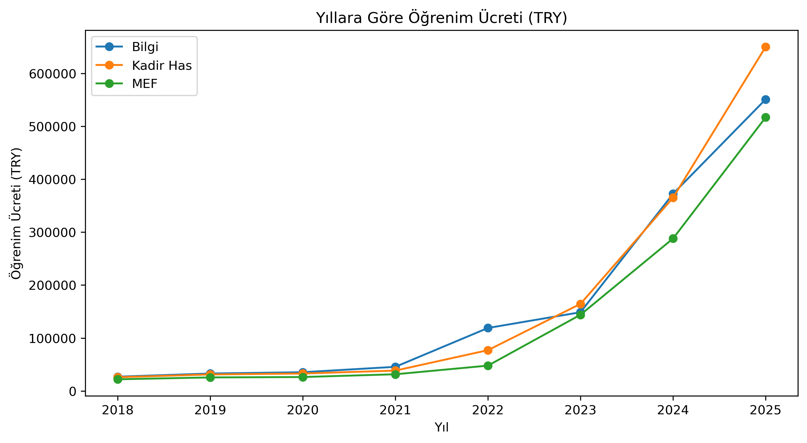

# 🎓 Turkey University Tuition Inflation (2018–2025)

  

This project analyzes how tuition fees at **MEF, Bilgi, and Kadir Has Universities** evolved between 2018 and 2025.  

To make the numbers more tangible, tuition is expressed not only in **TRY and USD**, but also in:  
- 🍔 **Big Mac Index** → how many Big Mac menus each year’s tuition equals  
- 💸 **Minimum Wage Months** → how many months you’d have to work without spending a dime  
- 📊 Clear trend charts, heatmaps, and funny comparisons  

---

## 📂 Dataset
- Source: Tuition fees manually collected from official university websites & internet (2018–2025)  
- Additional data:  
  - **Big Mac Menu Price (TRY)** → Numbeo / Economist Big Mac Index  
  - **Minimum Wage (TRY, monthly)** → TÜİK  
  - **USD/TRY exchange rate** → TCMB yearly averages  

| University | Year | Tuition_TRY | BigMacMenu_TRY | MinWage_TRY_Monthly | USD_TRY_ExchangeRate |
|------------|------|-------------|----------------|----------------------|-----------------------|
| MEF        | 2018 | 22,090      | 14             | 1450                 | 4.81                  |
| …          | …    | …           | …              | …                    | …                     |

---

## ⚙️ Methods
1. **Data Cleaning** with Pandas  
2. **Derived Metrics**:
   - Tuition in USD (`Tuition_TRY / USD_TRY_ExchangeRate`)  
   - Tuition in Big Macs (`Tuition_TRY / BigMacMenu_TRY`)  
   - Tuition in Minimum Wages (`Tuition_TRY / MinWage_TRY_Monthly`)  
3. **Visualization** with Matplotlib:
   - Line charts  
   - Bar charts (2018 vs 2025 shock comparison)  
   - Heatmaps (TRY, USD, Big Mac, Min Wages)  

---

## 💡 Key Insights
- 📈 Tuition increased nearly **25×** in 7 years (2018 → 2025).  
- 🍔 In 2025, one year of tuition equals **thousands of Big Mac menus**.  
- 💸 Even with a 50% scholarship, a student needs to work **2+ years on minimum wage** without spending to afford one year’s tuition.  
- 🚀 Tuition growth far outpaced both wage increases and inflation, making education less accessible.  
